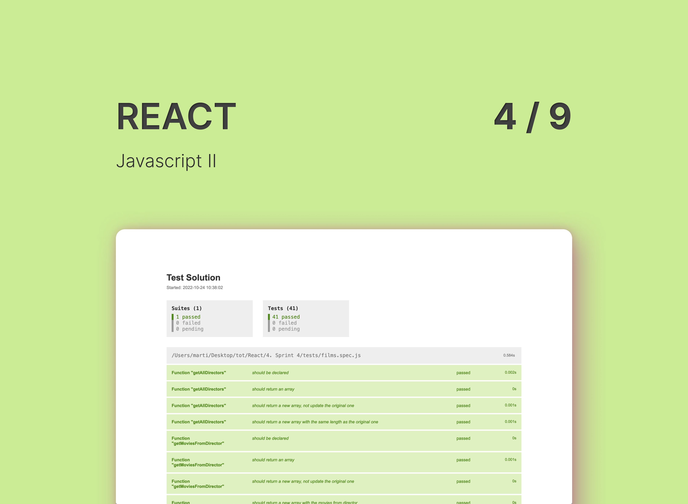

# Javascript II



Exercice consisting in the implementation of functions working with arrays, specially to practise ES6 array methods.
The code is tested using [Jest](https://jestjs.io/).

## Structure

There's a commit for each exercice.

## Available Scripts

```
npm run test:watch"
```

It generates a `test-results.html`file showing the passed jest tests.
